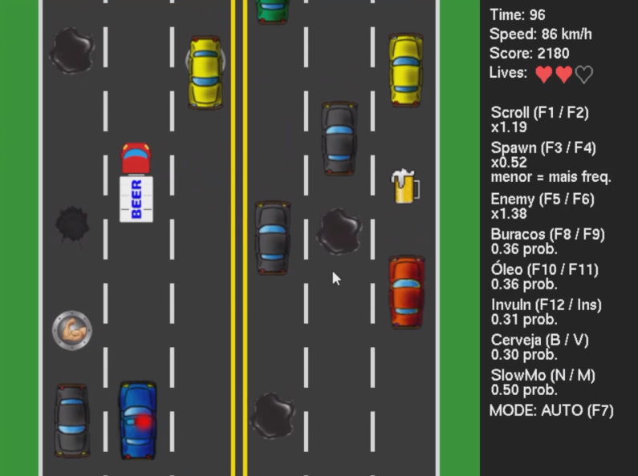

# Beer Truck - Projeto OpenGL 🍺🚚

“Bem-vindos ao Beer Truck! Aqui você é o motorista de um caminhão de cerveja tentando cruzar a cidade sem virar estatística. A missão? Pontuar o máximo possível desviando de tudo — carros, buracos e, claro, da polícia.

A vibe é de corrida arcade com sobrevivência: quanto mais você aguenta na pista, mais caótico fica. Mais tráfego, mais buracos, mais poças de óleo… mas também mais power-ups. É um jogo de reflexo e estratégia: saber quando arriscar e quando jogar no seguro.

Seu objetivo final: entrar no Top 3 do placar. Se conseguir, o jogo pede seu nome pra registrar essa lenda.”

---



## Integrantes do Grupo

* Alex Lopes
* Victor Saraiva
* Clauderson Xavier
* Aline Fernanda

---

## Disciplina

Este projeto foi desenvolvido para a disciplina de **Computação Gráfica (2025.1)** do curso de **Ciência da Computação** da **Universidade Federal do Agreste de Pernambuco (UFAPE)**.

---

## Como Jogar

### Versão Executável (Windows)

A maneira mais fácil de jogar é baixando o executável para Windows. Não precisa instalar nada!

➡️ **[Baixar beer_truck.1.0.exe](https://github.com/alexlsilva7/beer_truck/releases/download/1.0/beer_truck.1.0.exe)**

### Executando pelo Código-Fonte

Se preferir, você pode rodar o projeto diretamente do código-fonte:

1.  **Crie e ative um ambiente virtual:**
    ```bash
    # Cria o ambiente
    python -m venv .venv

    # Ativa no Windows (Git Bash, Linux ou Mac)
    source .venv/bin/activate

    # Ativa no Windows (CMD)
    # .venv\Scripts\activate.bat
    ```

2.  **Instale as dependências:**
    ```bash
    pip install -r requirements.txt
    ```

3.  **Execute o jogo:**
    ```bash
    python main.py
    ```
---

### Controles

O jogo tem suporte para teclado и controle (joystick).

#### Teclado
* **Setas Direcionais:** Mover, Acelerar e Frear
* **Barra de Espaço:** Buzinar
* **ESC:** Pausar o jogo ou voltar ao menu
* **Alt + Enter:** Alternar para tela cheia

#### Controle / Joystick
* **Analógico / D-Pad:** Mover, Acelerar e Frear
* **Botão 'X' (Padrão PS2):** Buzinar